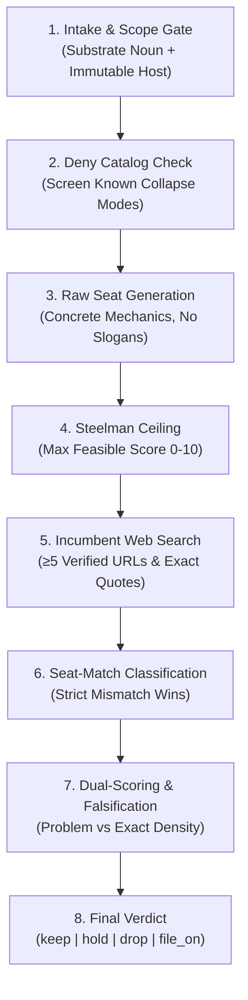

# Profinder Evaluation Methodology

## Overview: Occupancy vs. Pain

Most venture and startup frameworks evaluate ideas based on **pain**, **TAM** (Total Addressable Market), or **founder enthusiasm**. 

In systems programming, infrastructure, and developer tooling, **pain is abundant; empty seats are not**. 
Hundreds of developer pain points exist where every competent engineer feels friction, yet no standalone company can survive because:
1. The platform will absorb it with a 1-line configuration flag (e.g., `lock_timeout`, `ntfy --wait-cmd`).
2. The problem can be solved with a 50-line shell script or GitHub Action.
3. Incumbents already own the headline UX, leaving only edge-case leftovers that belong as a pull request on an existing tool (`file_on`).
4. The remaining pitch requires mathematical impossibilities or security antipatterns (e.g., rehydrating redacted secrets or claiming $O(1)$ exploration over $O(N!)$ interleavings).

**Profinder** inverts this dynamic. It evaluates **occupancy density**—measuring whether a concrete mechanical position in a technology stack is currently vacant, sparse, or already saturated by incumbents.

---

## The Profinder Pipeline

The workflow executes through 8 rigorous stages:

---

## 1. Scope Gate (No Slogans)

A slogan is not a seat. Terms like `"AI developer productivity"`, `"B2B SaaS"`, or `"Kubernetes management tool"` fail the scope gate immediately.

Every valid Profinder seat must specify:
*   **Substrate / Stack Noun:** A physical layer in software execution (e.g., *Process supervisor*, *Wire proxy*, *Compiler/linker*, *Kernel/eBPF/LSM*, *CI merge queue*, *Schema/tenancy cutover*, *Host runtime enforcement*).
*   **Immutable Host:** The infrastructure layer that the target customer cannot or will not replace (e.g., *AWS RDS PostgreSQL*, *GitHub Actions*, *Linux kernel cgroups*, *Apache Kafka / AWS MSK*).
*   **v1 As Shipped:** The physical artifact delivered on day one (e.g., a static binary CLI, a wire proxy daemon, or a managed replication worker).

---

## 2. The Dual-Scoring System

Rather than an arbitrary overall score (e.g., `85/100`), Profinder uses two orthogonal 0–10 density scores:

1.  **Problem Density (0–10):** Measures how many existing solutions, workarounds, or architectures address the underlying pain. This counts `adjacent_pain`, `wrong_substrate`, and `price_packaging` incumbents.
2.  **Exact-Mechanics Density (0–10):** Measures how many existing tools provide the **exact same stack placement and deliverable SKU** as the proposed v1. This counts **only** `exact` incumbents.

### Scoring Bands

| Band | Density Score | Commercial Meaning |
| :--- | :---: | :--- |
| **Greenfield** | 0.0 – 1.9 | Mechanics are entirely novel; no products sit in this stack position. |
| **Sparse** | 2.0 – 4.9 | Pieces exist or ad-hoc scripts are common, but no widely adopted product sits in the proposed seat. **(Pitchable Zone)** |
| **Occupied** | 5.0 – 7.9 | Adjacent tools or bundles already treat the pain. Remaining work is glue, a plugin, or a PR. |
| **Saturated** | 8.0 – 10.0 | Named commercial products already *are* this headline UX. Do not found. |

---

## 3. Incumbent Seat-Matching Labels

Every competitor discovered during research receives exactly one label. If multiple labels could apply, the **strictest mismatch** is enforced:

*   `exact`: Sits in the exact same stack placement and delivers the same core mechanical SKU.
*   `adjacent_pain`: Solves the same user problem using a completely different architectural approach (e.g., Temporal solving distributed sagas vs. a Kafka wire proxy catching interleaving bugs).
*   `wrong_substrate`: Addresses the concept on an incompatible technology plane (e.g., Vitess for MySQL vs. vanilla RDS PostgreSQL).
*   `language_scoped`: Scoped to an in-process language runtime (e.g., Node.js monkey-patching vs. an OS-level Linux syscall gate).
*   `price_packaging`: A commercial product exists nearby, but access, pricing tier, or platform lock-in leaves an opening for a narrower SKU.
*   `obsolete`: Abandoned or legacy tools that no longer function in modern production environments.

---

## 4. The 7 Automatic Rejects

A candidate cannot be marked as a pitchable company (`as_company: Keep`) if any of these 7 fatal collapse modes occur:

1.  A named incumbent already ships the **headline UX**.
2.  The product is a 50-line GitHub Action, curl wrapper, or editor hook.
3.  The core transform is mathematically non-invertible and the pitch would have to lie.
4.  The remaining wedge reverse-maps a security control (e.g., rehydrating redacted secrets or confused deputy).
5.  The remaining wedge is "add this to incumbent X" (e.g., add another ecosystem to Veln, ntfy, or OpenTofu).
6.  Silent mutation of user payloads without an advisory/linter-first v1.
7.  Sidecar without **host runtime enforcement** (e.g., a third-party lockfile that the native package manager or host platform does not consult).

---

## 5. The 3 Falsification Tests

A seat is falsified as "pitchable" only if all three tests pass:

1.  **Vacant Process:** A named process or protocol sits where no existing incumbent operates.
2.  **Not a Wrapper:** The runtime enforcement cannot be replaced by a trivial 50-line script, curl pipe, or git hook.
3.  **Mechanical Gap:** At least three incumbents can be named, and the gap between them and the candidate is **mechanical**, not merely a missing checkbox or marketing differentiation.

